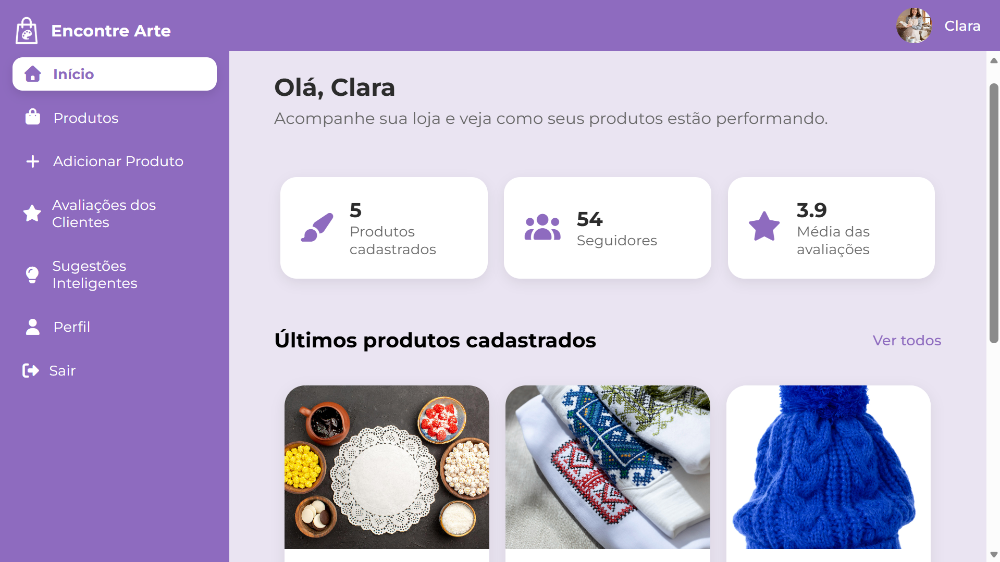
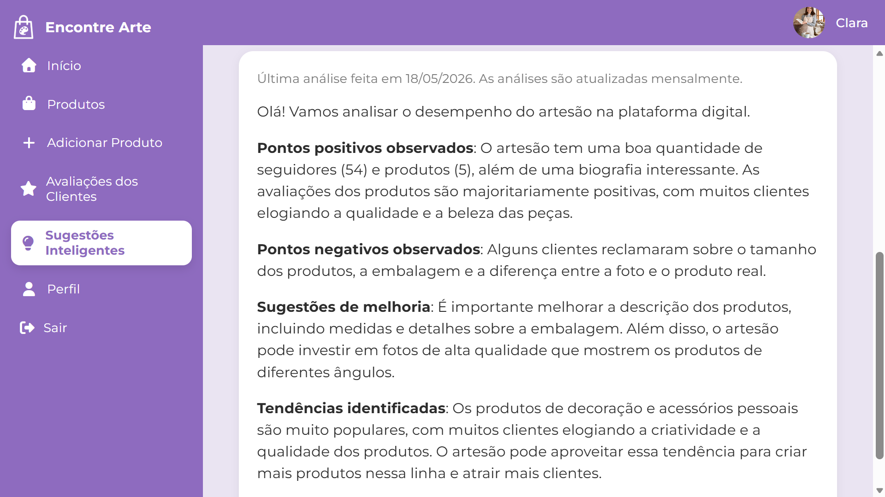

# Encontre Arte 

## Sumário

- [Introdução](#introdução)
- [Público-Alvo](#público-alvo)
- [Sobre o Sistema](#sobre-o-sistema)
- [Funcionalidades](#funcionalidades)
- [Telas do Sistema](#telas-do-sistema)
- [Inteligência Artificial Generativa](#inteligência-artificial-generativa)
- [Demonstração do Sistema](#demonstração-do-sistema)
- [Execução do Projeto](#execução-do-projeto)
- [Créditos de Imagens](#créditos-de-imagens)
- [Autora](#autora)
- [Orientação](#orientação)

---

## Introdução

Este repositório contém o código-fonte do sistema **Encontre Arte**, desenvolvido como Trabalho de Conclusão de Curso (TCC) no curso de Bacharelado em Sistemas de Informação.  

O sistema consiste em um marketplace voltado para artesãos que desejam divulgar seu trabalho e para consumidores que apreciam o artesanato.

O principal objetivo do projeto é fortalecer a conexão entre artesãos e consumidores por meio de uma plataforma digital acessível e intuitiva. Diante disso, destacam-se os seguintes objetivos específicos:

1. Destacar a produção artesanal através da apresentação detalhada dos artesãos e de seus produtos;
2. Facilitar a descoberta de artesãos e produtos;
3. Utilizar a Inteligência Artificial para análise de dados e geração de sugestões personalizadas para artesãos.

---

## Público-Alvo

O projeto é destinado a artesãos independentes inseridos na Economia Criativa, setor que engloba as atividades econômicas relacionadas à criatividade, ao capital intelectual e à inovação.
Além dos artesãos, também é direcionado para indivíduos que valorizam itens culturais, autorais e criativos.

---

## Sobre o Sistema

### Tecnologias

O sistema consiste em uma plataforma web desenvolvida utilizando as seguintes tecnologias:

- **PHP**: Linguagem de programação utilizada no desenvolvimento do back-end da aplicação.  
- **Laravel v12**: Framework PHP empregado para estruturar a aplicação e gerenciar rotas, controllers e modelos.  
- **MySQL**: Sistema de gerenciamento de banco de dados relacional utilizado para armazenamento das informações da aplicação.  
- **XAMPP**: Pacote de servidor web que inclui Apache, MySQL e PHP, utilizado para executar a aplicação localmente.  
- **Composer**: Gerenciador de dependências do PHP, utilizado para instalar e atualizar pacotes necessários ao projeto.  
- **Git**: Sistema de controle de versão utilizado para versionamento e histórico do código-fonte.  
- **HTML5, CSS3 e JavaScript**: Tecnologias empregadas na criação e estilização da interface gráfica da aplicação.
- **API Groq**: Tecnologia utilizada para acesso a modelos de Inteligência Artificial Generativa baseados em Processamento de Linguagem Natural (PLN), capazes de interpretar instruções e gerar respostas textuais.

### Arquitetura de Software 

A aplicação foi estruturada com base na arquitetura *MVC* (*Model-View-Controller*), padrão arquitetural adotado pelo framework *Laravel*. Esse modelo permite dividir o sistema em três camadas 
principais, separando a lógica de negócio da lógica de apresentação. 

- Camada *Model*:  responsável pela manipulação dos dados e pelas regras de negócio.
- Camada *View*: encarregada da interface gráfica, exibindo informações e capturando as interações do usuário. 
- Camada *Controller*: atua como intermediária entre o Model e a View, controlando o fluxo de dados e coordenando as ações do sistema. 

---

## Funcionalidades

### Cliente

O usuário cliente pode acessar serviços como:

- Cadastro e autenticação de usuário;
- Pesquisa de produtos com filtros como nome do produto, artesão vendedor, categoria, técnica artesanal, matéria-prima e localização;
- Pesquisa de artesãos com filtros como nome e localização;
- Avaliação de produtos;
- Gerenciamento de artesãos seguidos;
- Gerenciamento de produtos favoritos.

### Artesão

O usuário artesão pode explorar os seguintes recursos:

- Cadastro e autenticação de usuário;
- Gerenciamento de produtos vendidos;
- Acompanhamento do desempenho na plataforma;
- Visualização de avaliações recebidas;
- Sugestões Inteligentes para otimizar o relacionamento com os clientes.

---

## Telas do Sistema

### Artesão

#### Painel Inicial do Artesão com Métricas



#### Sugestões Inteligentes




### Cliente

#### Listagem e Busca de Produtos


#### Detalhes do Produto


#### Listagem e Busca de Artesãos


#### Detalhes do Artesão


---

## Inteligência Artificial Generativa

A Inteligência Artificial Generativa é utilizada para analisar dados periódicos sobre o desempenho do artesão na plataforma e para gerar um texto com observações e sugestões de melhoria sobre o trabalho que o artesão desenvolve ao divulgar e manter seu trabalho no marketplace.

### Dados

- Perfil do Artesão: Quantidade de seguidores, número de produtos cadastrados, descrição da história/biografia;
- Produtos: Quantidade de avaliações recebidas, número de favoritos, nome, descrição, categorias, técnicas, materiais;
- Avaliações dos Produtos: produto avaliado, nota e comentário atribuídos pelo cliente.

### Prompt 

Um prompt é um conjunto de instruções enviado ao modelo de IA.
As instruções enviadas pelo sistema são:

```text
Você é um assistente inteligente para artesãos em um contexto de Economia Criativa.
Considere os dados e os arquivos CSV abaixo.

CSV DO ARTESÃO
CSV DE PRODUTOS
CSV DE AVALIAÇÕES

Com base nessas informações, realize uma análise geral do desempenho do artesão na plataforma digital e gere: 

1. Pontos positivos observados;
2. Pontos negativos observados;
3. Sugestões de melhoria;
4. Tendências identificadas.
        
A estrutura do texto deve seguir a ordem acima de tópicos.
Utilize uma linguagem coloquial, motivacional e acolhedora, evitando excesso de termos técnicos.
As sugestões devem ser objetivas, simples e voltadas ao crescimento do artesão dentro da plataforma.
Evite repetir informações e priorize observações realmente relevantes.
Evite inventar informações que não estejam presentes nos dados enviados.
A resposta deve possuir no máximo 250 palavras.
```

### Limitações

As respostas geradas pela Inteligência Artificial podem variar conforme os dados disponíveis na plataforma, não substituindo a capacidade humana de análise e interpretação.

---

## Demonstração do Sistema

**Vídeo de Demonstração do Sistema**  
[Assista aqui no YouTube](https://youtu.be/p_5aloqmOH0)

---

## Execução do Projeto

### Requisitos

Antes de iniciar, certifique-se de ter instalado:

- **XAMPP** (com Apache e MySQL ativos)  
- **Composer** (gerenciador de dependências do PHP)  
- **Node.js** (ambiente de execução Javascript)
- **NPM** (gerenciador de pacotes do Node.js)
- **Git** (para clonar o repositório)
- **API Key/Chave API** (para integração com IA para geração de sugestões inteligentes)

---

### 1. Clonar o repositório

Dentro da pasta do XAMPP (`C:\xampp\htdocs`):

```bash
cd C:\xampp\htdocs
git clone https://github.com/codes-by-rafaeladias/Encontre-Arte.git 
cd Encontre-Arte
```

---

### 2. Instalar Dependências

```bash
composer install
```

---

### 3. Criar o Arquivo `.env`

Copie o arquivo de exemplo:

```bash
cp .env.example .env # Linux/Mac
copy .env.example .env # Windows
```

Depois, configure o `.env` com suas credenciais do banco e a chave da API GROQ:

```bash
DB_CONNECTION=mysql
DB_HOST=127.0.0.1
DB_PORT=3306
DB_DATABASE=nome_do_banco
DB_USERNAME=root
DB_PASSWORD=

GROQ_API_KEY=chave_api_groq
```

---

### 4. Gerar a Chave da Aplicação

```bash
php artisan key:generate
```

---

### 5. Rodar Migrações e popular banco de dados com categorias, técnicas e materiais

```bash
php artisan migrate --seed
```

---

### 6. Instalar dependências do Node.js

```bash
npm install
```

---

### 7. Iniciar o Servidor Vite

```bash
npm run dev
```

---

### 8. Iniciar o Servidor Laravel

```bash
php artisan serve
```

A aplicação estará disponível em: http://localhost:8000

### Extra: Geração de Sugestões Inteligentes

Para gerar e armazenar as sugestões inteligentes no banco de dados, execute em outro terminal: 

```bash
php artisan app:generate-ai-insights
```

---

## Créditos de Imagens

Recursos gráficos utilizados no projeto:

- Freepik — https://www.freepik.com/

---

## Autora

Rafaela Dias dos Santos

---

## Orientação

Professor Crescêncio Rodrigues Lima Neto