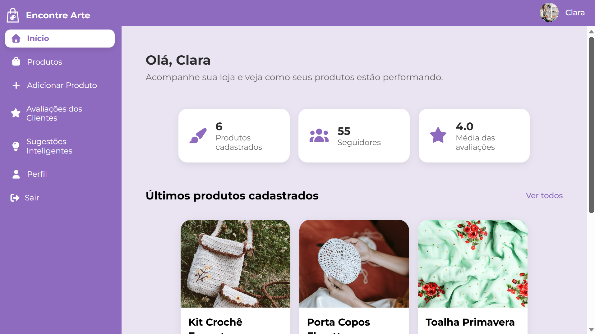
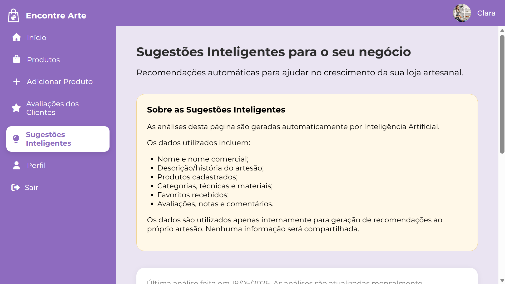
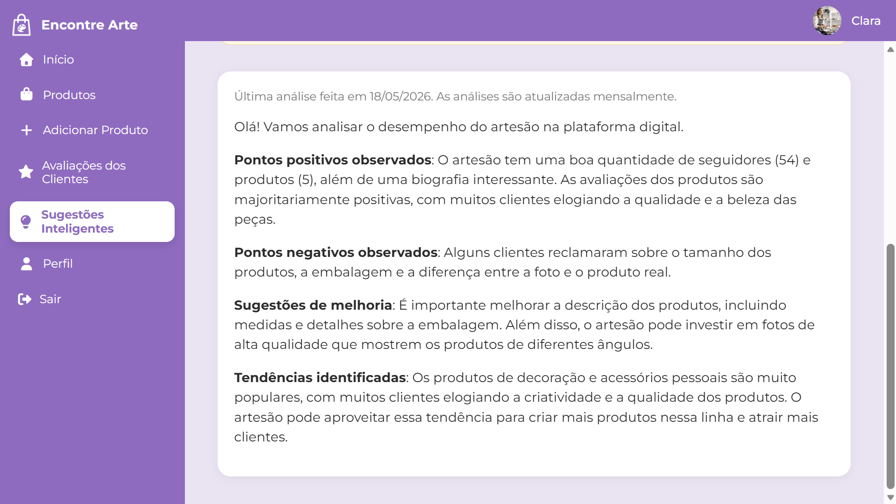
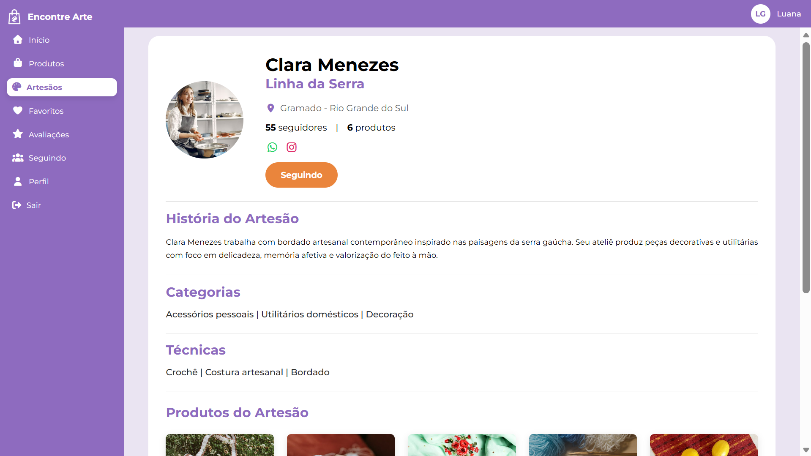

# Encontre Arte 

## Sumário

- [Autoria](#autoria)
- [Sobre este Repositório](#sobre-este-repositório)
- [Introdução](#introdução)
- [Sobre o Sistema](#sobre-o-sistema)
- [Funcionalidades](#funcionalidades)
- [Telas do Sistema](#telas-do-sistema)
- [Inteligência Artificial Generativa](#inteligência-artificial-generativa)
- [Inspeção do Protótipo](#inspeção-do-protótipo)
- [Demonstração do Sistema](#demonstração-do-sistema)
- [Execução do Projeto](#execução-do-projeto)
- [Estado do Projeto](#estado-do-projeto)
- [Créditos de Imagens](#créditos-de-imagens)

---

## Autoria

**Rafaela Dias dos Santos**  
Bacharelado em Sistemas de Informação

Orientador: **Prof. Dr. Crescêncio Rodrigues Lima Neto**

---

## Sobre este repositório

Este repositório contém a implementação do protótipo funcional Encontre Arte, desenvolvido como Trabalho de Conclusão de Curso (TCC) do curso de Bacharelado em Sistemas de Informação.

Versão do sistema utilizada no artigo: commit **7cee3ba**.

O trabalho também utiliza uma inspeção baseada em cenários simulados. Os artefatos utilizados durante a inspeção podem ser encontrados na pasta docs/simulacao

---

## Introdução

Este repositório contém o código-fonte do sistema **Encontre Arte**, desenvolvido como Trabalho de Conclusão de Curso (TCC) no curso de Bacharelado em Sistemas de Informação.  

O sistema consiste em um marketplace voltado para artesãos que desejam divulgar seu trabalho e para consumidores que apreciam o artesanato.

O principal objetivo do projeto é desenvolver uma plataforma digital que fortaleça a conexão entre artesãos e clientes em um contexto de Economia Criativa. Diante disso, destacam-se os seguintes objetivos específicos:

1. Destacar a produção artesanal através da apresentação detalhada dos artesãos e de seus produtos;
2. Facilitar a descoberta de artesãos e produtos;
3. Aplicar técnicas de Inteligência Artificial (IA) para análise de dados e geração de sugestões personalizadas aos artesãos.

### Público-Alvo

O projeto é destinado a artesãos independentes inseridos na Economia Criativa, setor que engloba as atividades econômicas relacionadas à criatividade, ao capital intelectual e à inovação.
Além dos artesãos, também é direcionado para indivíduos que valorizam itens culturais, autorais e criativos.

---

## Sobre o Sistema

### Tecnologias

O sistema consiste em uma plataforma web desenvolvida utilizando as seguintes tecnologias:

- **PHP**: Linguagem de programação utilizada no desenvolvimento do back-end da aplicação.  
- **Laravel v12**: Framework PHP empregado para estruturar a aplicação e gerenciar rotas, controllers e modelos.  
- **MySQL**: Sistema de gerenciamento de banco de dados relacional utilizado para armazenamento das informações da aplicação.  
- **XAMPP**: Pacote de servidor web que inclui Apache, MySQL e PHP, utilizado para executar a aplicação localmente.  
- **Composer**: Gerenciador de dependências do PHP, utilizado para instalar e atualizar pacotes necessários ao projeto.  
- **Git**: Sistema de controle de versão utilizado para versionamento e histórico do código-fonte.  
- **HTML5, CSS3 e JavaScript**: Tecnologias empregadas na criação e estilização da interface gráfica da aplicação.
- **API Groq**: Tecnologia utilizada para acesso a modelos de Inteligência Artificial Generativa baseados em Processamento de Linguagem Natural (PLN), capazes de interpretar instruções e gerar respostas textuais.

### Arquitetura de Software 

A aplicação foi estruturada com base na arquitetura *MVC* (*Model-View-Controller*), padrão arquitetural adotado pelo framework *Laravel*. Esse modelo permite dividir o sistema em três camadas 
principais, separando a lógica de negócio da lógica de apresentação. 

- Camada *Model*:  responsável pela manipulação dos dados e pelas regras de negócio.
- Camada *View*: encarregada da interface gráfica, exibindo informações e capturando as interações do usuário. 
- Camada *Controller*: atua como intermediária entre o Model e a View, controlando o fluxo de dados e coordenando as ações do sistema. 

---

## Funcionalidades

### Cliente

O usuário cliente pode acessar serviços como:

- Cadastro e autenticação de usuário;
- Pesquisa de produtos por meio de critérios de busca como nome do produto, artesão vendedor, categoria, técnica artesanal, matéria-prima e localização;
- Pesquisa de artesãos com critérios de busca como nome e localização;
- Avaliação de produtos;
- Gerenciamento de artesãos seguidos;
- Gerenciamento de produtos favoritos.

### Artesão

O usuário artesão pode explorar os seguintes recursos:

- Cadastro e autenticação de usuário;
- Gerenciamento de produtos vendidos;
- Acompanhamento do desempenho na plataforma;
- Visualização de avaliações recebidas;
- Sugestões Inteligentes para otimizar o relacionamento com os clientes.

---

## Telas do Sistema

### Artesão

#### Painel Inicial do Artesão com Métricas



#### Sugestões Inteligentes





### Cliente

#### Listagem e Busca de Produtos


#### Detalhes do Produto


#### Listagem e Busca de Artesãos


#### Detalhes do Artesão



---

## Inteligência Artificial Generativa

A Inteligência Artificial Generativa é utilizada para analisar dados periódicos sobre o desempenho do artesão na plataforma e para gerar um texto com observações e sugestões de melhoria sobre o trabalho que o artesão desenvolve ao divulgar e manter seu trabalho no marketplace.

Utilizou-se o modelo **Llama 3.3 70B Versatile** disponibilizado por meio da API Groq para geração do conteúdo textual. Durante o desenvolvimento e os testes iniciais do protótipo, foi utilizado o plano gratuito disponibilizado pela plataforma. No entanto, em um cenário de produção com maior quantidade de usuários e volume de requisições, a utilização da API poderá demandar investimentos financeiros para garantir a continuidade e a escalabilidade do serviço.

### Dados

- Perfil do Artesão: Quantidade de seguidores, número de produtos cadastrados, descrição da história/biografia;
- Produtos: Quantidade de avaliações recebidas, número de favoritos, nome, descrição, categorias, técnicas, materiais;
- Avaliações dos Produtos: produto avaliado, nota e comentário atribuídos pelo cliente.

### Prompt 

Um prompt é um conjunto de instruções enviado ao modelo de IA.
O prompt utilizado para geração das sugestões inteligentes encontra-se disponível em: 

`docs/simulacao/prompts/ia-generativa.md`

### Exemplo de Saída

Como resposta, é produzido um texto que destaca pontos positivos e pontos negativos observados, além de sugerir melhorias e identificar padrões observados nas avaliações e interações registradas na plataforma.


### Limitações

- As respostas geradas pela Inteligência Artificial podem variar conforme os dados disponíveis na plataforma, não substituindo a capacidade humana de análise e interpretação;
- As sugestões possuem caráter auxiliar e devem ser interpretadas de forma crítica pelo artesão, uma vez que modelos de linguagem podem produzir respostas imprecisas ou enviesadas. Dessa forma, cabe ao artesão avaliar a pertinência das recomendações apresentadas e decidir sobre sua eventual adoção.

### Privacidade

Para geração das Sugestões Inteligentes, são enviados à API Groq dados relacionados ao perfil do artesão, aos produtos cadastrados e às avaliações recebidas pelos produtos.
Os dados enviados são utilizados exclusivamente para geração das Sugestões Inteligentes, respeitando o escopo definido pelo sistema.
Informações sensíveis, como credenciais de acesso, não são compartilhadas com o modelo de Inteligência Artificial.

---

## Inspeção do Protótipo

Com o propósito de realizar uma inspeção do protótipo desenvolvido, cenários de uso foram simulados utilizando perfis representativos (personas) do público-alvo da plataforma. Os cenários de uso e as personas foram elaborados com o apoio do modelo de Inteligência Artificial Gemini.

### Procedimentos

1. Geração de seis personas fictícias utilizando o Gemini;
2. Criação de cenários de uso baseados nas funcionalidades do sistema com o apoio do Gemini;
3. Realização dos testes exploratórios;
4. Análise das observações.

### Prompt

O prompt utilizado para geração dos cenários de testes encontra-se disponível em:

`docs/simulacao/prompts/personas-cenarios-gemini.md`

### Saída do Gemini

A resposta detalhada e completa pode ser acessada em: 

`docs/simulacao/saida/saida-gemini.md`

#### Personas: 
1. Artesãos
- Tereza Maria dos Santos: Rendeira de bilro e líder de associação comunitária, 64 anos;
- Lucas Schimidt: Designer industrial focado em mobiliário sustentável com madeira de demolição, 28 anos;
- Clara Mendes: Assistente administrativa que produz cerâmica utilitária, 41 anos.

2. Clientes
- Mariana Albuquerque: Arquiteta e urbanista, 31 anos;
- Alberto Goldstein: Professor universitário de História aposentado, 55 anos;
- Camila Ribeiro: Estudante de Biologia, 22 anos.

#### Cenários de uso:
1. Artesãos
- Cenário 1: Dona Tereza cadastrando sua primeira renda de bilro;
- Cenário 2: Lucas analisando o desempenho e usando as sugestões inteligentes;
- Cenário 3: Clara gerenciando avaliações e atualizando produtos.

2. Clientes
- Cenário 4: Mariana buscando fornecedores locais para seu casamento;
- Cenário 5: Seu Alberto descobrindo um novo mestre da escultura em argila;
- Cenário 6: Camila buscando um acessório eco-friendly baseado em reputação.

### Análise dos Resultados

A inspeção realizada permitiu observar aspectos positivos e limitações do protótipo. Entre os aspectos positivos, destacam-se as funcionalidades disponíveis para a exploração de artesãos e produtos artesanais. Em contrapartida, foram identificadas limitações relacionadas à indisponibilidade da combinação simultânea de múltiplos filtros de pesquisa, à ausência de um painel com métricas de desempenho dos produtos e à impossibilidade de os artesãos responderem às dúvidas e comentários realizados pelos clientes nas avaliações dos produtos.

---

## Demonstração do Sistema

**Vídeo de Demonstração do Sistema**  
[Assista aqui no YouTube](https://youtu.be/p_5aloqmOH0)

---

## Execução do Projeto

### Requisitos

Antes de iniciar, certifique-se de ter instalado:

- **XAMPP** (com Apache e MySQL ativos): https://www.apachefriends.org/pt_br/download.html;  
- **Composer** (gerenciador de dependências do PHP): https://getcomposer.org/download/;
- **Node.js** (ambiente de execução Javascript e gerenciador de pacotes npm): https://nodejs.org/pt-br/download;
- **Git** (para clonar o repositório): https://git-scm.com/install/;
- **API Key/Chave API** (para integração com IA para geração de sugestões inteligentes): https://console.groq.com/keys.

---

### 1. Clonar o repositório

Dentro da pasta do XAMPP (`C:\xampp\htdocs`):

```bash
cd C:\xampp\htdocs
git clone https://github.com/codes-by-rafaeladias/Encontre-Arte.git 
cd Encontre-Arte
```

---

### 2. Instalar Dependências

```bash
composer install
```

---

### 3. Criar o Arquivo `.env`

Copie o arquivo de exemplo:

```bash
cp .env.example .env # Linux/Mac
copy .env.example .env # Windows
```

Depois, configure o `.env` com suas credenciais do banco e a chave da API GROQ:

```bash
DB_CONNECTION=mysql
DB_HOST=127.0.0.1
DB_PORT=3306
DB_DATABASE=nome_do_banco
DB_USERNAME=root
DB_PASSWORD=

GROQ_API_KEY=chave_api_groq
```

---

### 4. Gerar a Chave da Aplicação

```bash
php artisan key:generate
```

---

### 5. Rodar Migrações e popular banco de dados com categorias, técnicas e materiais

```bash
php artisan migrate --seed
```

---

### 6. Instalar dependências do Node.js

```bash
npm install
```

---

### 7. Iniciar o Servidor Vite

```bash
npm run dev
```

---

### 8. Iniciar o Servidor Laravel

```bash
php artisan serve
```

A aplicação estará disponível em: http://localhost:8000

### Extra: Geração de Sugestões Inteligentes

Para gerar e armazenar as sugestões inteligentes no banco de dados, execute em outro terminal: 

```bash
php artisan app:generate-ai-insights
```

---

## Créditos de Imagens

Recursos gráficos utilizados no projeto:

- Pexels — https://www.pexels.com/

---

## Estado do Projeto

Este projeto consiste em um protótipo funcional desenvolvido para fins acadêmicos como Trabalho de Conclusão de Curso.
Algumas funcionalidades frequentemente presentes em marketplaces, como pagamento, carrinho de compras e comunicação direta entre artesãos e clientes, não foram implementadas neste protótipo e podem ser exploradas em trabalhos futuros.